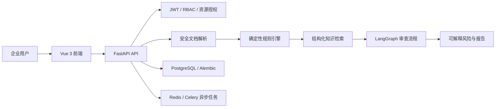
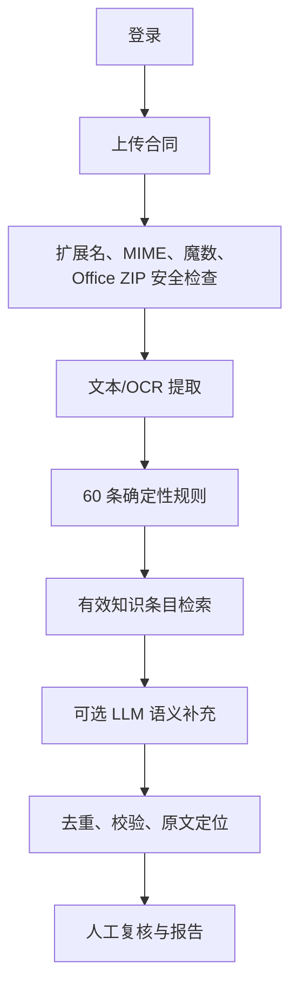

# 企业内部 AI 合同审查与合规管理平台

面向企业内部法务和业务团队的合同风险初筛平台，当前重点支持软件开发合同、技术服务合同、信息系统建设合同和软件外包合同。系统组合确定性规则、结构化知识检索和可选 Multi-Agent 分析，并保留风险原文、字符位置、规则来源和人工复核标记。

> AI辅助合同风险审查，不构成正式法律意见，重要合同应由专业法务或律师结合交易背景进行人工复核。

## 当前真实能力

- JWT 登录、刷新、RBAC、密码修改和 Token 版本失效。
- 合同创建、列表、版本、归档、删除和恢复；非管理员按所有者隔离。
- PDF、DOC、DOCX 和图片解析；DOCX 进行 ZIP 结构和压缩炸弹检查。
- 60 条确定性软件/技术合同规则，固定评分公式、错误隔离和原文偏移定位。
- 可选 LLM 补充分析；不可用时保留确定性规则结果，不虚构模型结论。
- 模型 API Key 使用 Fernet 认证加密，接口仅返回脱敏值。
- 结构化知识条目支持版本、效力状态、来源类型、条号和 `document_id`。
- Redis/Celery 真实异步审查任务支持阶段状态、幂等、取消、有限重试和失败恢复。
- 风险台账支持人工确认、驳回、整改、评论、分配和操作审计。
- 规则中心、知识库中心、合同版本对比、报告中心和用户权限页面均连接真实接口。
- JSON、DOCX、PDF、Markdown 和 XLSX 报告导出。
- 20 类完全虚构测试样本、20 份 Gold 标签和可执行评测/消融框架。

## 架构



## 审查流程



## 目录

```text
frontend/                  Vue 3 企业前端
migrations/                Alembic 迁移
samples/generated/         20 类完全虚构测试样本
samples/expected_results/  Gold 标签
scripts/                   数据生成、评测、消融脚本
src/contract_review/
  agents/                  现有 Agent 节点
  api/                     FastAPI 路由与鉴权
  database/                SQLAlchemy 模型
  rules/                   确定性规则引擎
  schemas/                 Pydantic API/领域契约
  services/                业务服务
tests/                     后端自动化测试
```

## 安全设计

- 生产环境强制配置 JWT、管理员密码、数据库、PostgreSQL 密码和模型凭据主密钥。
- 模型密钥只允许覆盖，数据库/JSON 存储中不保存明文。
- 修改密码、管理员重置、禁用账号和角色变化都会使旧 Token 失效。
- 合同和审查报告同时校验接口权限与资源所有权；越权统一返回不可枚举响应。
- 上传文件使用随机服务端文件名，并验证扩展名、MIME、文件魔数和 DOCX 内部结构。
- `.env`、上传文件、报告、日志、本地数据库和 coverage 产物不会进入 Git。

## 数据处理

原始文件保存在不可直接由 Nginx 执行的上传目录。审查风险保存命中文本、字符偏移、段落索引和人工复核状态；PDF 阅读器在存在真实映射时显示页码位置。缺少 OCR 坐标时只使用文本位置，不伪造坐标框。

## 快速启动

要求 Python 3.11+、Node.js 22+、pnpm。不要覆盖已有 `.env`。

```powershell
python -m venv .venv
.\.venv\Scripts\python.exe -m pip install -r requirements.txt
Copy-Item .env.example .env
$env:PYTHONPATH="src"
.\.venv\Scripts\python.exe -m alembic upgrade head
.\.venv\Scripts\python.exe -m uvicorn contract_review.main:app --reload
```

前端：

```powershell
Set-Location frontend
pnpm install
pnpm run dev
```

## Docker 启动

在 `.env` 中替换全部占位值后执行：

```powershell
docker compose config --quiet
docker compose up -d --build
docker compose ps
```

生产环境不得启用 Debug，不得使用示例密码或共享 JWT/模型加密密钥。

云服务器端口、HTTPS、备份和回滚步骤见 [docs/cloud-deployment.md](docs/cloud-deployment.md)。

## OCR 与 DOC 依赖

- 图片和扫描 PDF：安装 Tesseract，并安装 `chi_sim` 与 `eng` 语言包；可配置 `TESSERACT_CMD` 和 `TESSDATA_DIR`。
- 旧 `.doc`：安装 LibreOffice，或设置 `LIBREOFFICE_CMD`。依赖缺失会返回清楚错误，不会伪造解析成功。

## 模型配置

系统可在没有模型 Key 时运行确定性规则。启用模型时，通过管理员模型配置页覆盖 Key，或在本地 `.env` 设置供应商配置。生产环境必须设置独立 `MODEL_CREDENTIAL_ENCRYPTION_KEY`。不要在请求日志、浏览器存储或提交记录中保存完整 Key。

## 测试与真实指标

```powershell
$env:PYTHONPATH="src"
python -m pytest -q --cov=contract_review --cov-report=term
python scripts/evaluate_review.py
python scripts/benchmark_ablation.py
Set-Location frontend
pnpm run build
```

2026-07-13 本地验证：

- 后端测试：87 项，87 通过，0 失败。
- 后端整体覆盖率：85%。
- 前端 typecheck/build：通过；入口 JS 从 1,087.02 kB 拆分为 64.86 kB，Element Plus 与 ECharts 仍是较大的独立缓存 chunk。
- Alembic：单一 head `20260713_0007`，全新 SQLite 验证库可升级到 head。
- Docker Compose 语法：通过；当前验证机器 Docker Desktop daemon 未启动，因此完整镜像构建未进行真实测量。

## 评测结果

当前 Gold 为早期部分标注，结果只能作为规则回归基线，不能视为法律审查准确率：

- benchmark：deterministic benchmark
- 文本样本：11
- TP / FP / FN：26 / 132 / 0
- Precision / Recall / F1：0.1646 / 1.0000 / 0.2826
- 平均耗时：0.530 ms；P50：0.189 ms；P95：3.876 ms（单次本地测量）
- Token、模型成本、法律依据可追溯率：未进行真实测量

误报偏高主要来自召回优先的“缺失条款”规则和不完整 Gold 标注，需要法务校准。

## Multi-Agent 对比

`scripts/benchmark_ablation.py` 提供 A 单 Prompt、B 规则+单 Prompt、C Multi-Agent、D Multi-Agent+RAG+规则结构。当前仅 B 运行确定性基准；A/C/D 没有真实模型数据，指标均明确为“未进行真实测量”。

## 已知限制

- LangGraph 已拆分分类、提取、规则、知识、语义分析、验证、修订和报告协调职责；LLM Token/费用遥测仍需供应商回调补齐。
- Celery/Redis 已接入真实阶段、幂等、取消和有限重试；跨主机生产压测和 worker 强制中断恢复尚未进行真实测量。
- 版本风险自动匹配会在置信不足时标记 `uncertain_match`，不会自动宣称风险已整改。
- Legal 的“分配给我”授权关系尚未形成独立数据库模型。
- 完整法规库需要组织提供合法、可靠、持续维护的数据源。
- 完整 OCR 坐标依赖具体 PDF/OCR 引擎输出，当前无法定位时会安全降级为文本位置。

## Roadmap

1. 补齐供应商 Token/费用遥测和真实模型消融实验。
2. 增加 Legal 分配范围与组织/部门授权模型。
3. 接入合法法规数据源、混合检索和更新审计。
4. 扩充法务 Gold 标注并降低缺失条款规则误报。
5. 在预发布环境进行 worker 故障、队列积压、备份恢复和大合同压力测试。

## 截图与演示视频

仓库不提交虚构产品截图。录制演示前使用测试账号和 `samples/generated/`：登录 → 上传虚构合同 → 查看风险与原文 → 导出报告。录制画面不得出现 `.env`、真实 Key、邮箱、真实合同或日志。

## 面试重点

- 为什么确定性规则优先，以及如何稳定评分和定位原文。
- Fernet 认证加密、旧密文迁移和 Token 版本撤销。
- 如何用 RBAC + 所有权防止 IDOR。
- 为什么不虚构覆盖率、法规和模型指标。
- 如何从同步原型演进到可恢复、幂等的异步审查平台。
