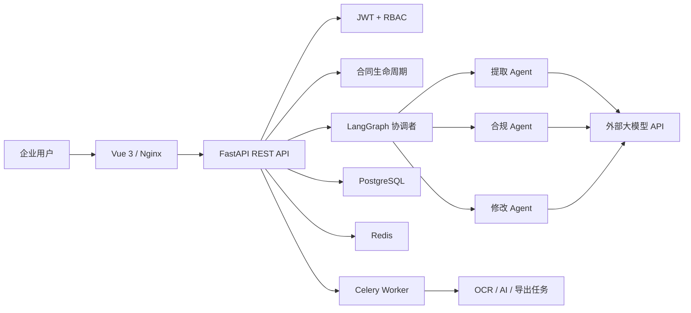

# 衡契 Enterprise AI Contract Review Platform

面向企业合同全生命周期的 Multi-Agent 智能审查 SaaS。后端使用 FastAPI、LangChain、LangGraph，前端使用 Vue 3、TypeScript、Pinia、Element Plus 与 ECharts。系统只调用外部大模型 API，不在本地加载模型，普通开发机也能运行。

## 核心能力

- JWT 注册、登录、刷新令牌、修改密码、忘记密码预留接口，以及登录/操作审计日志。
- Admin、Legal、Employee 三类角色和接口级 RBAC。
- 合同搜索、分页、排序、分类、标签、收藏、归档、软删除、恢复和多版本管理。
- PDF、DOC、DOCX、PNG、JPG、JPEG、TIFF、BMP；扫描 PDF 和图片自动 OCR。
- Coordinator、Extractor、Compliance Checker、Refiner 四类 Agent 的 LangGraph 协作流程。
- 风险评分、风险等级、缺失条款、修改建议、企业内控/法规依据检索。
- OpenAI、DeepSeek、Claude、Gemini、Qwen 和 OpenAI 兼容模型配置中心。
- 按合同类型和 Agent 阶段配置 Prompt，支持版本、启停和默认模板。
- 合同上下文连续对话、PDF 双栏阅读和风险条款页码/坐标定位。
- 上传、AI 初审、法务审核、主管审核、归档工作流与站内通知。
- JSON、Word、PDF、Markdown、Excel 五种报告导出。
- PostgreSQL 数据模型、Alembic 迁移、Redis 缓存适配器、Celery 异步任务。
- CPU、内存、接口耗时、错误率和 AI 调用监控；提供 Prometheus 文本指标。
- Docker Compose 一键编排 PostgreSQL、Redis、FastAPI、Celery Worker/Beat、Vue 和 Nginx。

## 架构



## 快速启动

### 方式一：Docker 完整版

前提是电脑安装并启动 Docker Desktop。在项目根目录创建 `.env`，并设置 `POSTGRES_PASSWORD`、`JWT_SECRET_KEY`、`BOOTSTRAP_ADMIN_PASSWORD`；需要 AI 时再填写 `LLM_API_KEY`。这些值不要提交到 Git。

```powershell
Copy-Item .env.example .env
docker compose up -d --build
```

打开：

- 企业前端：http://127.0.0.1:8080
- API 文档：http://127.0.0.1:8080/docs
- Prometheus 指标：http://127.0.0.1:8080/api/v1/monitoring/metrics

查看状态或停止：

```powershell
docker compose ps
docker compose logs -f backend
docker compose down
```

### 方式二：Windows 本地开发

后端：

```powershell
python -m venv .venv
.\.venv\Scripts\python.exe -m pip install -r requirements.txt
Copy-Item .env.example .env
.\run_server.ps1
```

前端需要 Node.js 22 和 pnpm：

```powershell
Set-Location frontend
pnpm install
pnpm run dev
```

打开 `http://127.0.0.1:5173`。管理员邮箱和密码由本地 `.env` 中的 `BOOTSTRAP_ADMIN_EMAIL`、`BOOTSTRAP_ADMIN_PASSWORD` 设置。

## API Key 配置

推荐登录管理员账号后，在“系统配置 -> 模型配置”中新建配置，填写服务商、API Key、Base URL 和模型名，然后点击启用。接口只返回脱敏后的 Key。

也可以在 `.env` 配置：

```env
ENABLE_LLM=true
LLM_API_KEY=your-provider-api-key
LLM_BASE_URL=https://api.deepseek.com/v1
LLM_MODEL_NAME=deepseek-chat
```

修改 `.env` 后需要重启后端。不要提交 `.env`，它已被 Git 忽略。

## 数据库迁移

```powershell
$env:PYTHONPATH="src"
.\.venv\Scripts\python.exe -m alembic upgrade head
.\.venv\Scripts\python.exe -m alembic current
```

Docker 后端每次启动时会自动执行 `alembic upgrade head`。项目不使用 SQLite。

## 测试与构建

```powershell
.\.venv\Scripts\python.exe -m pytest -q
.\.venv\Scripts\python.exe -m ruff check src tests --ignore B008,E501
Set-Location frontend
pnpm run build
```

GitHub Actions 会自动执行后端测试、静态检查、前端构建和两个 Docker 镜像构建。

## 工程目录

```text
├── frontend/                 Vue 3 企业后台与 Nginx 配置
├── migrations/               Alembic 数据库迁移
├── src/contract_review/
│   ├── agents/               Multi-Agent 节点
│   ├── api/                  RESTful 路由
│   ├── core/                 配置、安全、异常、监控
│   ├── database/             SQLAlchemy 模型与会话
│   ├── graph/                LangGraph 状态与拓扑
│   ├── infrastructure/       Redis 等基础设施适配器
│   ├── services/             领域服务
│   └── tasks/                Celery 后台任务
├── tests/                    后端自动化测试
├── Dockerfile
├── docker-compose.yml
└── requirements.txt
```

## 安全说明

- 生产环境必须替换 JWT 密钥、管理员初始密码和数据库密码。
- 上传文件执行扩展名白名单、大小限制和文件签名校验，伪装文件会被拒绝。
- API 启用 CORS、可信 Host、限流、CSP、点击劫持和 MIME 嗅探防护。
- ORM 使用参数化查询；前端默认转义动态文本，避免直接渲染不可信 HTML。
- AI 输出仅用于辅助初审，正式签署前仍需企业法务结合交易背景复核。

## 开发规范

- 使用 `src/` 布局、类型注解和 Pydantic 请求/响应模型。
- API 返回统一结构：`code`、`message`、`data`；旧审查接口保留兼容响应。
- 新功能按 schema、service、endpoint、test 分层实现。
- 每个模块测试通过后单独提交，禁止在功能提交中混入无关重构。

答辩与比赛材料位于 `docs/`，示例采购合同位于 `samples/`。
