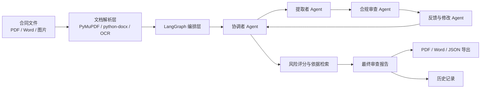
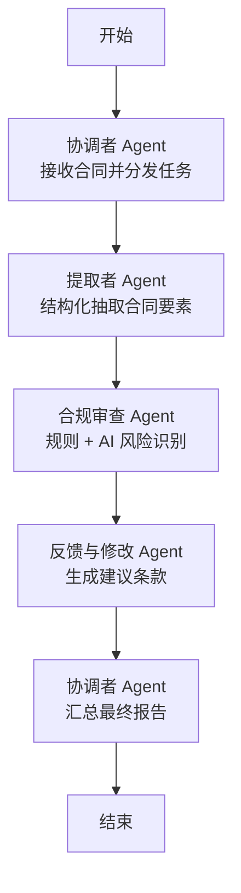

# 技术架构说明

## 总体架构

## 后端分层

- `api`：FastAPI 路由层，负责上传、历史记录、报告下载和健康检查。
- `services`：业务服务层，负责文档解析、审查流程调用、报告导出、历史记录、风险评分和依据检索。
- `agents`：Agent 节点层，负责提取、合规审查、修改建议和报告汇总。
- `graph`：LangGraph 编排层，定义节点拓扑和状态流转。
- `llm`：外部大模型适配层，通过环境变量读取 API Key、模型名和 Base URL。
- `knowledge`：内置法律法规摘要和企业内控规则。
- `web`：产品演示页面和中文 Swagger 页面。

## LangGraph 流程

## 低算力设计

本项目不加载本地大模型，不依赖高性能显卡。大语言模型能力通过 DeepSeek、OpenAI 兼容接口等外部 API 接入。本地只负责文件解析、规则判断、流程编排、报告生成和页面展示，因此普通笔记本也能运行。

## 可解释性设计

系统通过四种方式提升可解释性：

1. 结构化提取结果：展示主体、金额、期限、付款、违约责任等关键字段。
2. 风险点字段化：每个风险点包含类别、等级、问题说明、审查依据和修改方向。
3. 依据检索：从内置法规和内控规则中检索相关片段。
4. Agent 协同轨迹：记录每个节点的动作和输出摘要。

## 可扩展方向

- 将轻量关键词检索升级为向量 RAG。
- 按合同类型建立审查模板。
- 增加用户、角色和审批流。
- 增加模型调用日志和规则版本管理。
- 建立脱敏合同评测集，形成量化测试报告。

